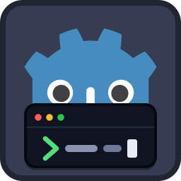
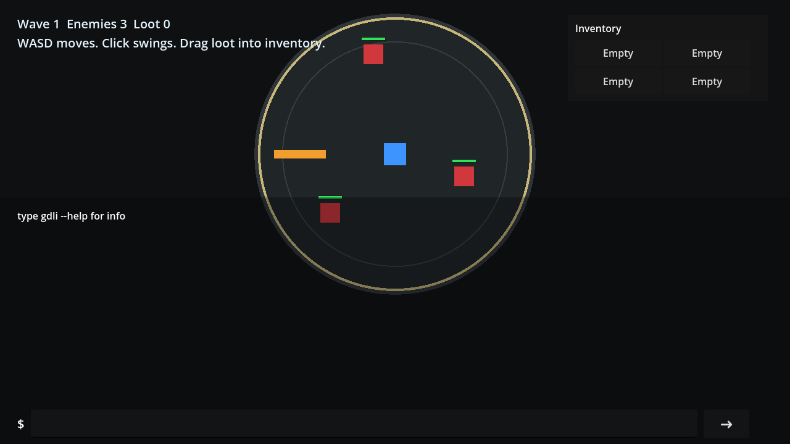
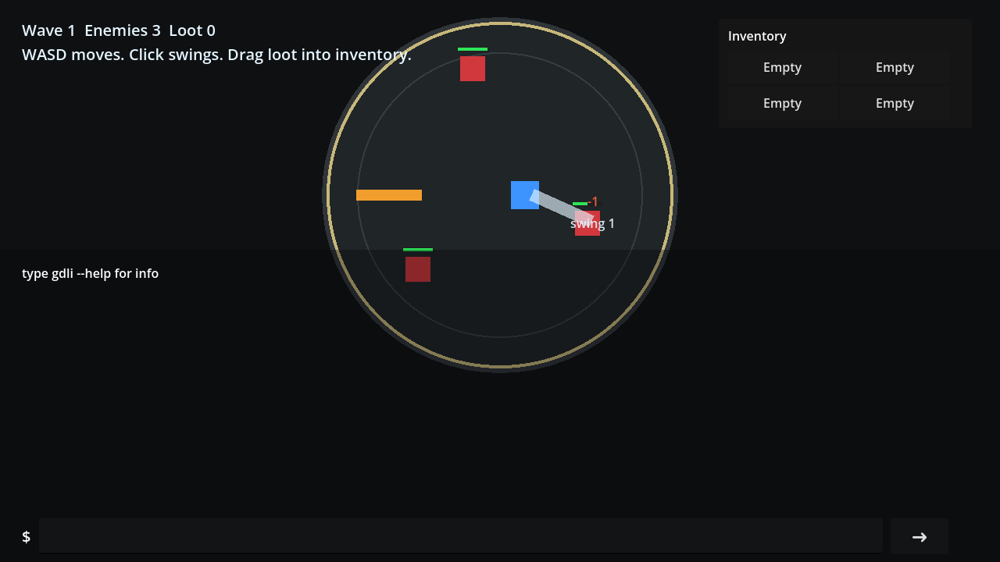
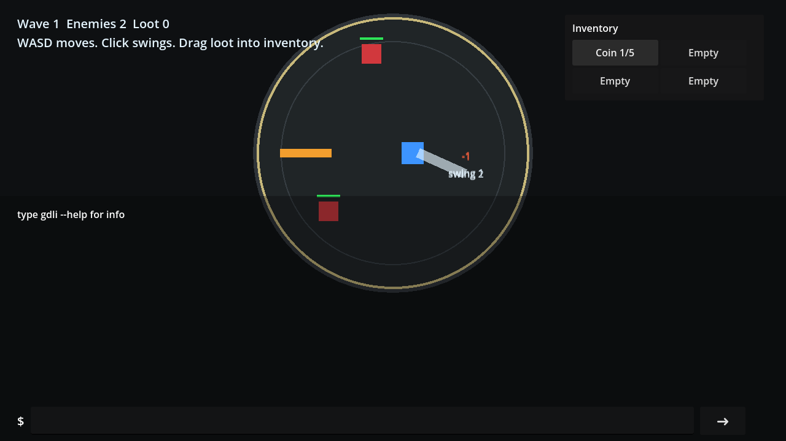

# gdli — Godot Agent CLI

An agent-facing CLI that drives and observes **any** Godot 4.x project — in the **editor**
(edit mode) and the **running game** (play mode) — over a tiny TCP/NDJSON link. Playwright-for-Godot.

One shared GDScript core is hosted twice: as an `@tool EditorPlugin` (editor) and as an autoload (game).
Each binds an **ephemeral** port and records it in `.gdli/<game|editor>.port` under the project root; a
single dependency-free Node client discovers the right port from your cwd and routes each verb to the
right process under the hood — you never pick a port.

```
gdli launch                                  # run the game (default); explicit: gdli launch --game
gdli scene load res://addons/gdli_plugin_example/demo/main.tscn
gdli ignore add TerminalPanel                  # drop noisy terminal transcript changes from later diffs
gdli node add . Node2D --name Spawned --diff  # add a node; show only what changed
gdli inspect                                  # scene snapshot; mints an @eN ref per node
gdli inspect --ui                             # only visible Controls, each with its screen rect
gdli click --ref '<Button ref>' --diff --ticks 1
gdli eval 'root.get_child_count()'            # quick one-shot script; uses headless if nothing is running
gdli eval --save child_count 'root.get_child_count()'
gdli eval '@child_count'                      # reuse an ephemeral eval handle

gdli launch --in-editor                       # open the editor if needed, then play its current scene
gdli check                                    # compile-check every .gd -> 'ok' or the broken files
gdli kill                                     # stop everything (explicit: --both/--all)
```
(`gdli` after `npm i -g` / `npm link`; otherwise `node addons/godot_agent_cli/cli/bin/gdli.js <verb>`.)



The bundled example plugin includes a demo scene at
`res://addons/gdli_plugin_example/demo/main.tscn`: a small 2D arena game with a transparent in-game
terminal overlay. WASD moves the player inside the ring, clicks swing a sword toward the pointer,
enemies take two hits and drop loot, and loot can be dragged into inventory slots. The terminal starts
with only `type gdli --help for info`; submitted commands route through the `GodotAgentCli` singleton's
command parser. Press the `?` button in the terminal to start the documentation-derived walkthrough,
which runs the same commands shown in this README, the plugin guide, and the bundled skills.

For unattended demos, the example plugin can type and submit the tutorial for you and optionally record
a small WebM:

```
gdli gdli_plugin example setup --autoplay
gdli gdli_plugin example setup --autoplay --record --record-seconds 45 --record-fps 8 --record-width 640 --record-out res://addons/gdli_plugin_example/docs/assets/demo-autoplay.webm
```

`--autoplay` loops back to step 1 after the final command by resetting the demo. `--record` captures
low-framerate scaled frames from the game viewport and encodes them with ffmpeg, defaulting to
`res://addons/gdli_plugin_example/docs/assets/demo-autoplay.webm`.







The walkthrough covers the terminal, click-to-attack proof, loot drops, and inventory changes with
the corresponding gdli command visible in the entry bar.

Reproduce the demo proof flow:

```
gdli launch --scene res://addons/gdli_plugin_example/demo/main.tscn
gdli ignore add TerminalPanel
gdli screenshot --out addons/gdli_plugin_example/docs/assets/demo-console.png
gdli inspect --ui
gdli enter text "gdli --help" --ref TerminalPanel/InputRow/CommandInput --clear --submit
gdli key D --hold --diff --ticks 8                     # move into sword range
gdli key D --release
gdli click 752 286 --diff --ticks 1
gdli click 752 286 --diff --ticks 2
gdli inspect --mark before_loot
gdli drag --ref Arena/Loot/Loot1 --ref2 Hud/InventoryPanel/Margin/Rows/Slots/Slot1 --ticks 2
gdli drag --ref Hud/InventoryPanel/Margin/Rows/Slots/Slot1 700 230 --hold --diff --ticks 1
gdli release 700 230 --ticks 1
gdli inspect --diff before_loot
gdli gdli_plugin example greet Codex
gdli gdli_plugin example enemies spawn 2 --diff
gdli eval --file res://addons/gdli_plugin_example/demo/tutorial_steps/02_spawn_loot.gd --diff
gdli gdli_plugin example items collect best --diff
```

## Author's Note
Guiding Principles:
1. Practice like you play -> Test like the player - Agent written unit tests are technical debt providing a false sense of confidence; I want visual proof a feature works or it didn't happen.
	- can tell the agents to disable modules except for input and observe (or do it yourself if youre not lazy) forcing the agent to interface only through the UI.
	- vision models are bad and lie. Integrates with the scene tree to pair visual proof with structural proof in the active scene tree.
2. Say less do more - Minimize tokens (and latency) especially on the critical paths.
3. Don't worry about it - The less the agent worries about, the less neurotic it becomes and the easier it is to steer, probably, its just gambling at the end of the day and we are just trying to load the dice.
	- purposeful naming "gdli" ~= 2 tokens,  <verb> ~=1 token, "--flag" ~= 2 tokens; Overall ~3-10 tokens per action when the equivalent in gdscript would be slightly longer and more error prone / require researching the code base more than just reading verb --help
	- default options that just work (optimized for my use cases, its open source, fork and change the defaults if you want)
	- progressive disclosure in --help
	- failed command logging to support iteration on verb naming and agent prompting / skills or whatever (todo: integrate with coding harness to capture surrounding llm context or at least link to session id)
	- eval is batch mode, agents love to write scripts this lets them do it but also where they can reuse their gdli understanding verbatim in the scripts benefiting from the hopefully more efficient and intuitive cli language than 
	- extend with plugins for domain specific verbs. Fits well into a model <-> view-controller style project.
4. Multi-agent workflow support - More or less supports multiple instances on a single machine. Not fully tested likely issues. Ideally put them in separate work trees, but they could technically use the same instance, they'd just be changing the game/editor state underneath each other.

Key Differentiators:
1. Node @eN handles for input actions
2. Diffs on actions
3. Optimized for agents (benchmark results pending)

Otherwise there's a few other options out there that you should probably consider.

This project is AI generated, not really reviewed too closely, and still in active development. I am prioritizing game dev not tool dev but will get around to polishing it eventually if its still useful by then. If you want to implement or fix something please feel free to fork or contribute or whatever.

The following is AI slop. Good luck!
----
## Install

The addon and the Node client are **one bundle**: the CLI lives *inside* the addon at
`addons/godot_agent_cli/cli/` (and the agent skills at `addons/godot_agent_cli/skills/`), so either
install path gives you both halves.

**Via npm (Node-first):**
```
npm i -g godot-agent-cli      # puts `gdli` on your PATH (the client is dependency-free)
cd /path/to/your-godot-project
gdli install .                # copies the bundled addon into addons/godot_agent_cli/
```

**Via the Godot Asset Library (editor-first):** in Godot, **AssetLib → search "Godot Agent CLI" →
Download → Install** (installs `addons/godot_agent_cli/`, CLI + skills included). Then either
`npm i -g godot-agent-cli` for a global `gdli`, or run the bundled client directly:
`node addons/godot_agent_cli/cli/bin/gdli.js <verb>` (Node ≥18 required for the client).

Either way, enable the plugin in Godot: **Project → Project Settings → Plugins → Godot Agent CLI**
(registers the `@tool` EditorPlugin + the `GodotAgentCli` autoload). Live in the editor at once, in the
game on run.

- Godot binary: set `GODOT_BIN` or pass `--godot <path>` (default is the Windows 4.7-mono GUI exe) —
  only needed for `gdli launch` / headless `gdli check`; verbs that talk to an already-running instance
  don't need it.
- No global install? Run `node addons/godot_agent_cli/cli/bin/gdli.js <verb>` directly, or `npm link`
  from the repo for a local `gdli`. `npm run package` builds the two distributables into `dist/`: the
  npm tarball and the Asset Library zip (the self-contained addon).

## Routing
Each verb has a target policy; the client picks the process:
- **auto** (most verbs) — the game if it's running, else the selected editor scene. Override with
  `--game` / `--editor` / `--port`.
- **game** — `input` (real input pipeline; inert in the editor).
- **editor** — `file *`, `scene save` (authoring). `launch --in-editor` / `kill --in-editor` drive the
  editor's own play/stop under the hood.

**Auto-launch** (default): if a verb needs a live instance and none is running, the client spawns one
first — the **game** by default, the **editor** for editor-only verbs (`file *`, `scene save`) — waits
for it, then runs. It stays up for reuse (`gdli kill` to stop). Bare `gdli eval ...` is the exception:
when no instance is running, it defaults to a *transient, no-window* game instance and stops it after
the command. Add `--headless` to get that same one-shot behavior for other verbs.

**Timing**: `--timeout <duration>` stops the client waiting for a command response, and
`--timewarning <duration>` emits a warning while the command is still running. Durations accept
`ms`, `s`, or `m` suffixes; bare numbers are seconds. Use them on `gdli launch` to save per-session
defaults for the launched game/editor, or on a single verb to override that command only:
`gdli launch --timeout 45s --timewarning 10s`, `gdli inspect --timeout 5s`. With `--diff`/`--mark`,
the client adds requested settle time to both budgets (`--time` seconds, `--physics` frames at 17ms
each, or `--ticks` idle frames at 34ms each; same precedence as the server). For synchronous Godot
handlers, timeout closes the client connection; it cannot preempt code already blocking Godot's main
thread unless the instance is a transient headless process that the client can kill.

Snapshots are rooted at the **scene** (`current_scene` / `get_edited_scene_root()`), never `/root`,
so editor GUI, autoloads, and the harness itself are excluded from diffs by construction.

## Diffs & marks (core — any verb)
`--diff`, `--mark`, and the settle flags are handled by the **dispatcher**, so they work on *every* verb
(built-ins and plugins) and never touch handler code:
- `<verb> --diff` — snapshot the whole scene before/after the command, return the delta on the
  response (`diff: {added,removed,changed[{path,field,from,to}]}`). Most useful on mutating verbs:
  `node add … --diff`, `click --ref '<Button ref>' --diff --ticks 1`.
- `<verb> --mark <name>` — save the post-command scene as a named checkpoint; `gdli mark` lists them.
  Re-marking the same name overwrites (there's no separate clear).
- `<verb> --diff <name>` — compare the current scene against checkpoint `<name>` (cumulative change).
  The client matches the token after `--diff` against existing mark names; a non-match is treated as a
  bare `--diff` and left as a positional.
- **Settle** — the snapshot delay (only with `--diff`/`--mark`; default = immediate): `--ticks <n>` idle
  frames, `--physics <n>` physics frames, or `--time <s>` seconds, so input/physics effects can land.
- `--ignore <glob>` drops matching scene-relative paths from the delta (one-shot; `--ignore "UI/*"`
  hides matching UI subtrees).
- `gdli ignore add <glob>` adds a process-global ignore for the running game/editor, so every later
  diff skips that noisy subtree before snapshotting. Use this for high-churn UI such as
  `TerminalPanel`: `gdli ignore add TerminalPanel`, `gdli ignore list`,
  `gdli ignore remove TerminalPanel`, `gdli ignore clear`. These ignores are in-memory session state
  and reset when the process exits.

With `--diff`, the client prints **only the diff** — the diff is the answer, so the verb's own data
(e.g. `inspect`'s whole-scene dump) is suppressed. Add `--data` to also show it (useful for the return
value of `node call` / `eval`).

## Modules
Everything is on by default; `config.json` is a denylist (`{"disabled":[...]}`). Toggle live with
`gdli config --disable eval` / `--enable eval` (persists to `config.json`, no restart), or edit the
file by hand / in the editor — the server mtime-watches it. `gdli config` reports the current state;
`gdli verbs` prints the live registry (disabled modules vanish from both).

| Module | Verbs | Target |
|---|---|---|
| core | `verbs` `config` `mark` `ignore list/add/remove/clear` `check` (+ client-side `launch`/`status`/`kill`) | meta |
| scene | `scene tree` · `scene load` · `scene save` | auto · save→editor |
| node | `node get/set/add/remove/reparent/call/attach/detach` | auto |
| observe | `inspect [--root --depth --full --ui]` (mints `@eN`; `--ui` = visible Controls + rects) · `screenshot` | auto |
| input | `click drag release hover key act scroll` `enter text` (`--ref '@eN'`, `--mods`, `--button`, `drag --hold`, `key/act --hold --release`) | game |
| introspect | `class list` · `class info` | auto |
| eval | `eval <gdscript \| @handle>` · `--file` · `--save`/`--list`/`--entry` (`root`/`argv`/`gdli("…")` in scope) | auto |
| file | `file create/read/list/delete` | editor |

`inspect --nodes` is accepted as the explicit default scene-node mode; `inspect --ui` narrows to visible Controls.

## Eval & macros
`eval` is the escape hatch *and* the macro engine — one scripting surface, one vocabulary:
- **Launch behavior** — if a game or editor instance is already running, `eval` uses it. If nothing is
  running, bare `gdli eval ...` defaults to a transient headless game instance and tears it down after
  the command. Use `--game`, `--editor`, or `--port` when you want to force a specific live target.
- **Forms** — a single expression (auto-returned), a statement block, or a full file (just write your
  funcs incl. an entry — `func run():`, or name it and pass `--entry`; no base class to extend, and
  `root`/`argv`/`gdli()` are injected). The entry may take `argv` (`func run(argv):`) or read it
  ambiently. `eval --file <path>` runs a file; its compile errors surface automatically. For the whole
  project at once, use `gdli check` (below).
- **In scope** — `root` (scene root), `argv` (tokens after `eval '@handle' …`), and **`gdli("verb args")`**,
  which invokes any gdli verb by the *same string you'd type at the CLI* and returns its raw result —
  so you compose granular verbs without learning a second API:
  ```
  gdli eval --save child_count 'root.get_child_count()'
  gdli eval '@child_count'
  ```
- **Macros** — `eval --save <name> "<code>"` stores the script in the gitignored `.gdli/handles/`,
  `eval '@<name>' [args…]` runs it (args land in `argv`), `eval --list` lists them. Handles are *ephemeral*
  by design — for persistent, shareable logic, write a plugin instead.

`gdli("…")` runs in-process on eval's instance (no cross-instance routing) and obeys the same
editor/game guards as a normal call.

## Check
`gdli check` compile-checks every `.gd` under `res://` and prints `ok` (exit 0) or the files that fail
to parse (exit 1). **Hybrid:** if an instance is running it checks there (instant); otherwise it spawns
a quick headless Godot. Either way it reads current disk and covers the whole project — each script is
compiled in isolation, with its `class_name` (if any) blanked first so re-compiling an already-registered
global class can't crash the engine. The offline path also surfaces the engine's parse-error message and
line; the live path returns just the failing-file list.

## Agent skills
Three Claude-style agent skills ship **inside the addon** at `addons/godot_agent_cli/skills/`, so they
travel with both install paths:
- **gdli-develop-debug** — develop/debug a project through gdli: launch, inspect & mutate the live tree,
  prove changes with diffs, script with `eval`.
- **gdli-playtest-review** — verify a feature like a real player: screenshots + UI clicks by `@eN` ref,
  paired with scene-tree proof (no state-forcing shortcuts).
- **gdli-maintain-extend** — work on the harness itself: architecture, codebase map, and how to add a
  verb or write a plugin.

To use them with Claude Code, copy or symlink that folder's contents into your project's
`.claude/skills/` (or point your agent harness at the directory).

## Extending with plugins
Drop an addon folder containing a `gdli_module.gd` that exposes `register_into(server)` — the
harness auto-discovers it at boot (alongside the built-ins), its verbs join `verbs`, and they route by
their `meta.target` with **zero client changes**. See `addons/gdli_plugin_example/gdli_module.gd`:

```gdscript
extends RefCounted
var server
func register_into(srv) -> void:
	server = srv
	server.registry.register("gdli_plugin_example", "gdli_plugin example greet", _greet, {
		"help": "demo plugin verb — greet by name.",
		"target": "game",
		"args": [{"name": "name", "type": "string", "required": false, "default": "world", "help": "who to greet"}],
	})
func _greet(p): return {"greeting": "hello, %s" % str(p.get("name", "world"))}
```

`server` is the live core — plugins call its helpers dynamically (no type import): `registry.register`,
`to_json`/`from_json`,
`resolve_node(path|@ref)`, `target_root()`, `is_editor()`, `diff.snapshot(root, depth)`, `mint_refs(nodes)`,
`screen_pos(node|@ref)`, `call_gdli_string(cmd)`, `err(code, msg)`. The plugin's `module` name
(`"gdli_plugin_example"`) is what `config --disable` toggles. A verb is
`<module> <verb>` (multi-word); `name` is both the CLI path and the wire `cmd`. That's the whole contract —
this is exactly how a domain plugin (e.g. game-specific verbs over a C# backend) would attach.

**Full authoring guide: [docs/PLUGINS.md](docs/PLUGINS.md)** — the `server` API, targeting/guards,
decoding/encoding typed values, reaching autoloads / a C# backend, and a worked example.

## Wire contracts
- **Protocol** — one TCP conn per command: `{id,cmd,params}` → `{id,ok:true,data}` |
  `{id,ok:false,err:{code,message}}` (codes `not_found`/`disabled`/`bad_params`/`handler_error`/`editor_only`/`game_only`).
- **Codec** — non-JSON Variants encode as `{"__t":"Vector2","v":[1,2]}`, nodes as `{"__t":"Node","path":".."}`;
  decode also accepts a Godot expression string (`"Vector2(1,2)"`).
- **Registry** — `register(module, name, handler, meta)`; `name` is both the CLI path and the wire
  `cmd`. A plugin registers the same way → its verbs appear in `verbs` and route with zero client changes.
- **Diff/marks** — the dispatcher snapshots the whole scene (salient props) and attaches `diff` /
  `marked` to the response envelope; marks are per-instance in-memory. Verbs stay diff-agnostic.
- **Refs** — `@eN` minted by `inspect` (incl. `--ui`), resolved before node lookup.

## Test
The tool tests itself — drive it by hand against a live instance: `gdli launch`, then exercise verbs and
assert with the structural diff (`<verb> --diff`) or `eval`. `gdli launch --editor` covers the editor /
`file *` / `--in-editor` paths.

Every failed command is appended to `.gdli/failures.log` (timestamp · command · error), segmented by a
per-`launch` session marker that's written only for runs that actually fail — review it to see what went
wrong during a run; a clean run leaves nothing behind.

## Notes & scope
- Editor `screenshot` briefly switches the main screen to 2D/3D (per the scene root) so the canvas
  renders, captures it, then restores the prior screen. Game screenshot is full window-resolution.
- Multi-worktree friendly: each instance binds an **ephemeral** port and records it in
  `.gdli/<game|editor>.port` under its project root, so separate checkouts run side-by-side without
  collision; the client discovers the right port from cwd (`gdli status [path]` to inspect another).
- One game per editor (within a project); no multi-client / movie capture (out of scope by design).

## License
[MIT](../LICENSE) © Tibor. The bundled addon carries its own copy of the license at
`addons/godot_agent_cli/LICENSE`.
